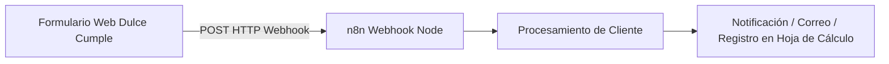

# 🍰 Dulce Cumple - Sistema de Pedidos con Automatización n8n Webhook


**Dulce Cumple** es una solución web interactiva diseñada para la captación de clientes y recepción de pedidos de pastelería y repostería personalizada. Integra un formulario web receptivo conectado directamente a un flujo de trabajo automatizado en **n8n Cloud** mediante Webhooks en tiempo real.

---

## 📑 Tabla de Contenidos
- [✨ Características Principales](#-características-principales)
- [⚙️ Integración con n8n Webhook](#️-integración-con-n8n-webhook)
- [🛠️ Tecnologías Utilizadas](#️-tecnologías-utilizadas)
- [📂 Estructura del Proyecto](#-estructura-del-proyecto)
- [🚀 Instalación y Uso](#-instalación-y-uso)
- [👤 Autoría](#-autoría)

---

## ✨ Características Principales

- 📋 **Formulario de Registro de Clientes**: Captura de datos personales y detalles del pedido.
- ⚡ **Envío Asíncrono de Datos**: Transmisión de datos mediante la API Fetch codificada en `x-www-form-urlencoded`.
- 🔄 **Conexión Directa a n8n Cloud**: Envío del evento al webhook configurado en `https://m4ylttz.app.n8n.cloud/webhook-test/dulce-cumple/nuevo-cliente`.
- ⏳ **Retroalimentación Visual**: Deshabilitación dinámica del botón de envío ("Enviando...") y confirmación de mensajes en pantalla.
- 🎨 **Diseño Atractivo**: Estilos visuales optimizados para negocios de repostería y eventos.

---

## ⚙️ Integración con n8n Webhook

El proyecto incluye el archivo `flujo.json`, el cual contiene la definición completa del flujo de automatización en n8n:



---

## 🛠️ Tecnologías Utilizadas

- **HTML5**: Estructura de formulario y contenedores.
- **CSS3**: Estilos visuales personalizados.
- **JavaScript ES6+**: Fetch API, manejo de eventos (`submit`) y manipulaciones asíncronas.
- **n8n Automation Engine**: Flujo de trabajo en la nube para procesamiento automático de clientes (`flujo.json`).

---

## 📂 Estructura del Proyecto

```file-tree
dulce-cumple/
├── index.html          # Interfaz web y formulario de pedidos
├── styles.css          # Estilos del sitio y del formulario
├── script.js           # Lógica JavaScript para envío de datos al Webhook de n8n
├── flujo.json          # Diagrama y configuración del workflow exportado de n8n
└── README.md           # Documentación oficial del proyecto
```

---

## 🚀 Instalación y Uso

1. **Clonar / Abrir el proyecto**:
   ```bash
   git clone <url-del-repositorio>
   ```

2. **Ejecución de la interfaz**:
   - Abre `index.html` en tu navegador.
   - Diligencia los campos del formulario y presiona enviar para probar la llamada al Webhook.

3. **Importación del flujo en n8n**:
   - Accede a tu instancia de **n8n**.
   - Selecciona **Import from File** e importa el archivo `flujo.json` para activar el backend de automatización.

---

## 👤 Autoría

Desarrollado por **María Castro** ([@CastroMariaJ](https://github.com/CastroMariaJ)).
